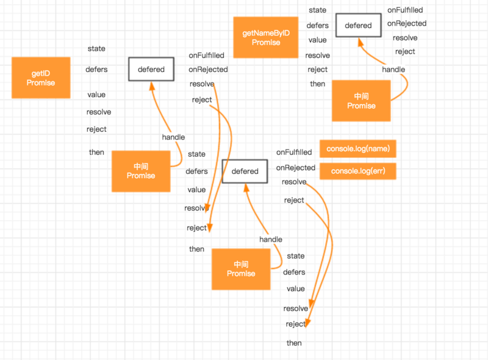
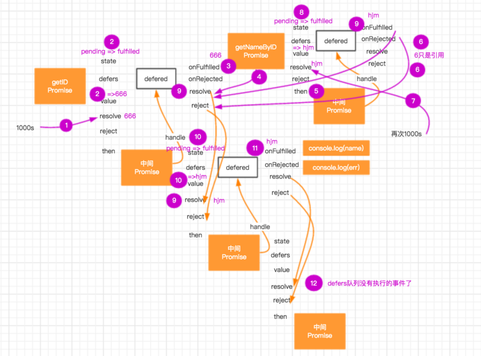

### promise简单实现

### 参考：
[剖析 Promise 之基础篇](https://tech.meituan.com/promise-insight.html)
[理解Promise简单实现的背后原理](https://segmentfault.com/p/1210000008832836/read)
[JS Promise的实现原理]http://bruce-xu.github.io/blogs/js/promise
这个 feature 实现的难点在于：如何衔接当前 promise 和后邻 promise。

首先对 then 方法进行改造：
```
this.then = function (onFulfilled) {
    return new Promise(function (resolve) {
        handle({
            onFulfilled: onFulfilled || null,
            resolve: resolve
        });
    });
};

function handle(deferred) {
    if (state === 'pending') {
        deferreds.push(deferred);
        return;
    }

    var ret = deferred.onFulfilled(value);
    deferred.resolve(ret);
}
```
then 方法改变很多，这是一段暗藏玄机的代码：

then 方法中，创建了一个新的 Promise 实例，并作为返回值，这类 promise，权且称作 bridge promise。这是串行 Promise 的基础。另外，因为返回类型一致，之前的链式执行仍然被支持；
handle 方法是当前 promise 的内部方法。这一点很重要，看不懂的童鞋可以去补充下闭包的知识。then 方法传入的形参 onFullfilled，以及创建新 Promise 实例时传入的 resolve 均被压入当前 promise 的 deferreds 队列中。所谓“巧妇难为无米之炊”，而这，正是衔接当前 promise 与后邻 promise 的“米”之所在。
新增的 handle 方法，相比改造之前的 then 方法，仅增加了一行代码：

deferred.resolve(ret);
这意味着当前 promise 异步操作成功后执行 handle 方法时，先执行 onFulfilled 方法，然后将其返回值作为实参执行 resolve 方法，而这标志着后邻 promise 异步操作成功，接力工作就这样完成啦！

以例 2 代码为例，串行 Promise 执行流如下：


promise series flow
这就是所谓的串行 Promise？当然不是，这些改造只是为了为最后的冲刺做铺垫，它们在重构底层实现的同时，兼容了本文之前讨论的所有功能。接下来，画龙点睛之笔--最后一个方法 resolve 是这样被改造的：
```
function resolve(newValue) {
    if (newValue && (typeof newValue === 'object' || typeof newValue === 'function')) {
        var then = newValue.then;
        if (typeof then === 'function') {
            then.call(newValue, resolve);
            return;
        }
    }
    state = 'fulfilled';
    value = newValue;
    setTimeout(function () {
        deferreds.forEach(function (deferred) {
            handle(deferred);
        });
    }, 0);
}
```
啊哈，resolve 方法现在支持传入的参数是一个 Promise 实例了！以例 4 为例，执行步骤如下：

getUserId 生成的 promise （简称 getUserId promise）异步操作成功，执行其内部方法 resolve，传入的参数正是异步操作的结果 userid；
调用 handle 方法处理 deferreds 队列中的回调：getUserMobileById 方法，生成新的 promise（简称 getUserMobileById promise）；
执行之前由 getUserId promise 的 then 方法生成的 bridge promise 的 resolve 方法，传入参数为 getUserMobileById promise。这种情况下，会将该 resolve 方法传入 getUserMobileById promise 的 then 方法中，并直接返回；
在 getUserMobileById promise 异步操作成功时，执行其 deferreds 中的回调：getUserId bridge promise 的 resolve 方法；
最后，执行 getUserId bridge promise 的后邻 promise 的 deferreds 中的回调
上述步骤实在有些复杂，主要原因是 bridge promise 的引入。不过正是得益于此，注册一个返回值也是 promise 的回调，从而实现异步操作串行的机制才得以实现。

一图胜千言，下图描述了例 4 的 Promise 执行流：


promise series flow
失败处理
本节处理之前遗留的 rejected 状态问题。在异步操作失败时，标记其状态为 rejected，并执行注册的失败回调：
```
// 例5

function getUserId() {
    return new Promise(function (resolve, reject) {
        // 异步请求
        Y.io('/userid/1', {
            on: {
                success: function (id, res) {
                    var o = JSON.parse(res);
                    if (o.status === 1) {
                        resolve(o.id);
                    } else {
                        // 请求失败，返回错误信息
                        reject(o.errorMsg);
                    }
                }
            }
        });
    });
}

getUserId().then(function (id) {
    // do sth with id
}, function (error) {
    console.log(error);
});
```
JS Bin

有了之前处理 fulfilled 状态的经验，支持错误处理变得很容易。毫无疑问的是，这将加倍 code base，在注册回调、处理状态变更上都要加入新的逻辑：

function Promise(fn) {
    var state = 'pending',
        value = null,
        deferreds = [];

    this.then = function (onFulfilled, onRejected) {
        return new Promise(function (resolve, reject) {
            handle({
                onFulfilled: onFulfilled || null,
                onRejected: onRejected || null,
                resolve: resolve,
                reject: reject
            });
        });
    };

    function handle(deferred) {
        if (state === 'pending') {
            deferreds.push(deferred);
            return;
        }

        var cb = state === 'fulfilled' ? deferred.onFulfilled : deferred.onRejected,
            ret;
        if (cb === null) {
            cb = state === 'fulfilled' ? deferred.resolve : deferred.reject;
            cb(value);
            return;
        }
        ret = cb(value);
        deferred.resolve(ret);
    }

    function resolve(newValue) {
        if (newValue && (typeof newValue === 'object' || typeof newValue === 'function')) {
            var then = newValue.then;
            if (typeof then === 'function') {
                then.call(newValue, resolve, reject);
                return;
            }
        }
        state = 'fulfilled';
        value = newValue;
        finale();
    }

    function reject(reason) {
        state = 'rejected';
        value = reason;
        finale();
    }

    function finale() {
        setTimeout(function () {
            deferreds.forEach(function (deferred) {
                handle(deferred);
            });
        }, 0);
    }

    fn(resolve, reject);
}
增加了新的 reject 方法，供异步操作失败时调用，同时抽出了 resolve 和 reject 共用的部分，形成 finale 方法。

错误冒泡是上述代码已经支持，且非常实用的一个特性。在 handle 中发现没有指定异步操作失败的回调时，会直接将 bridge promise 设为 rejected 状态，如此达成执行后续失败回调的效果。这有利于简化串行 Promise 的失败处理成本，因为一组异步操作往往会对应一个实际功能，失败处理方法通常是一致的：
```
// 例6

getUserId()
    .then(getUserMobileById)
    .then(function (mobile) {
        // do sth else with mobile
    }, function (error) {
        // getUserId或者getUerMobileById时出现的错误
        console.log(error);
    });
```
JS Bin

异常处理
如果在执行成功回调、失败回调时代码出错怎么办？对于这类异常，可以使用 try-catch 捕获错误，并将 bridge promise 设为 rejected 状态。handle 方法改造如下：
```
function handle(deferred) {
    if (state === 'pending') {
        deferreds.push(deferred);
        return;
    }

    var cb = state === 'fulfilled' ? deferred.onFulfilled : deferred.onRejected,
        ret;
    if (cb === null) {
        cb = state === 'fulfilled' ? deferred.resolve : deferred.reject;
        cb(value);
        return;
    }
    try {
        ret = cb(value);
        deferred.resolve(ret);
    } catch (e) {
        deferred.reject(e);
    } 
}
```
如果在异步操作中，多次执行 resolve 或者 reject 会重复处理后续回调，可以通过内置一个标志位解决。
```
// 例4

getUserId()
    .then(getUserMobileById)
    .then(function (mobile) {
        // do sth with mobile
    });

function getUserMobileById(id) {
    return new Promise(function (resolve) {
        Y.io('/usermobile/' + id, {
            on: {
                success: function (i, o) {
                    resolve(JSON.parse(o).mobile);
                }
            }
           });
    });
}
```

